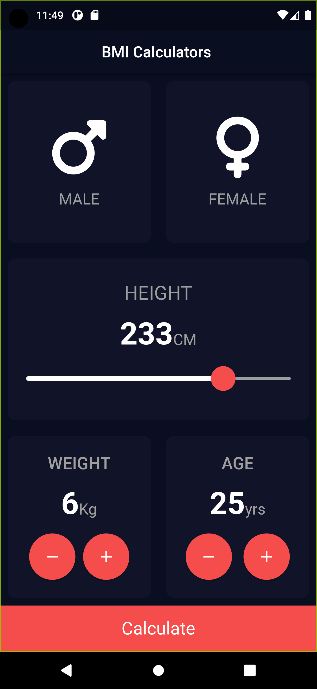

# BMI_CALCULATOR APP
BMI App calculate your body mass index and tells you if you are obase , overweight , underweight and normal

Just I`m currently learning Mobile App this is The Second Project building Fluter
This Projects covers a lot of new carrier of my knowledge I learned 

<ul>
<li>stateless_Widget and statefull_widget</li>
<li>How to Deal Material Design</li>
<li>exports and import files</li>
<li>Extract widgets</li>
<li>How to Navigate new page</li>
<li>How to use fontawesome in flutter</li>
</ul> 
A new Flutter project.

## Getting Started

This project is a starting point for a Flutter application.

A few resources to get you started if this is your first Flutter project:

- [Lab: Write your first Flutter app](https://docs.flutter.dev/get-started/codelab)
- [Cookbook: Useful Flutter samples](https://docs.flutter.dev/cookbook)

For help getting started with Flutter development, view the
[online documentation](https://docs.flutter.dev/), which offers tutorials,
samples, guidance on mobile development, and a full API reference.
